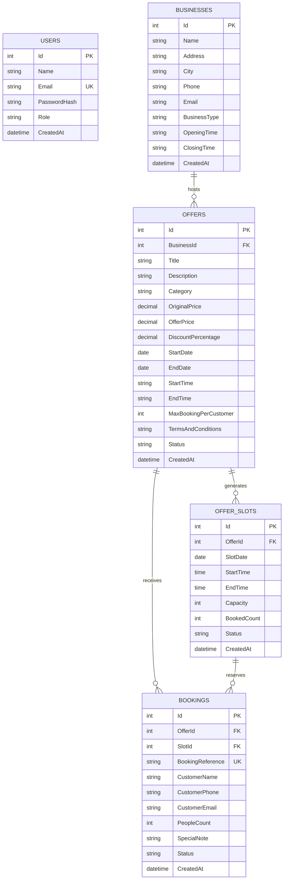

# 🎯 Smart Offer Slot Booking System

A premium full-stack slot-booking web application built during the Willovate Hackathon. The system allows businesses to publish limited-time, custom-parameterized offers, generates daily booking slots based on operating hours, enforces customer safety limits, and allows admin dashboard management with real-time slot control.

---

## 🛠️ Tech Stack Compliance

| Layer | Technology |
| :--- | :--- |
| **Frontend** | React 18 + TypeScript + Vanilla CSS + Tailwind CSS |
| **Bundler** | Vite 5 |
| **Routing** | React Router v6 |
| **HTTP Layer** | Axios |
| **Backend API** | .NET 8 / 10 Web API |
| **ORM** | Entity Framework Core 8 |
| **Database** | Supabase (PostgreSQL via Npgsql) |
| **Authentication** | JWT Bearer Tokens + BCrypt Password Hashing |
| **API Documentation** | Swagger / OpenAPI |

---

## 🏗️ Project Directory Architecture

```
Willovate/
├── backend/
│   ├── SmartOffer.sln
│   └── SmartOffer.Api/
│       ├── Controllers/          # Auth, Business, Offers, Slots, Bookings, Dashboard
│       ├── Data/                 # AppDbContext (Seeding logic, EF migrations)
│       ├── DTOs/                 # Request/Response payloads
│       ├── Migrations/           # Entity Framework database migrations
│       ├── Models/               # User, Business, Offer, OfferSlot, Booking
│       ├── Program.cs            # Middlewares, DI configuration, CORS, JWT setup
│       ├── appsettings.json      # Production settings
│       ├── .env                  # Local secrets and keys (gitignored)
│       └── .env.example          # Environment settings template
└── frontend/
    ├── index.html
    ├── package.json
    ├── tailwind.config.js
    ├── .env                      # API endpoint configuration (gitignored)
    ├── .env.example              # Environment settings template
    └── src/
        ├── api/                  # Axios HTTP client interface
        ├── components/           # Common components (Navbar, OfferCard, StatusBadge)
        ├── pages/
        │   ├── admin/            # AdminLogin, AdminDashboard, CreateOffer
        │   └── public/           # PublicOfferList, OfferDetail, BookingFlow
        ├── types/                # Strict TypeScript declaration files
        ├── App.tsx               # Main routing component
        └── main.tsx              # React mounting root
```

---

## 💾 Database Schema & ER Diagram

The database utilizes five relational tables hosted on PostgreSQL.

### Entity-Relationship Diagram



### Table Schema Definition

1.  **Users Table (`Users`)**: Holds administrator authentication profiles.
2.  **Businesses Table (`Businesses`)**: Holds profiles of partner businesses.
3.  **Offers Table (`Offers`)**: Details dynamic deals, time limits, original/offer pricing, and rules.
4.  **Offer Slots Table (`OfferSlots`)**: Individual slots automatically generated for active offers based on hours and capacity.
5.  **Bookings Table (`Bookings`)**: Slot reservation entries including reference codes and guest details.

---

## 🚀 Step-by-Step Setup Guide

### 1️⃣ Supabase Setup
1. Create a free PostgreSQL database project at [supabase.com](https://supabase.com).
2. Go to **Settings → Database** and copy your **connection string** (URI format or individual fields).

### 2️⃣ Backend Setup (.NET 8 / 10 API)
1. Navigate to the backend directory:
   ```bash
   cd backend/SmartOffer.Api
   ```
2. Create your `.env` file using the template:
   ```bash
   cp .env.example .env
   ```
3. Open `.env` and fill in your connection string and credentials:
   ```env
   ConnectionStrings__DefaultConnection="Host=db.YOUR_REF.supabase.co;Port=5432;Database=postgres;Username=postgres;Password=YOUR_DB_PASSWORD;SSL Mode=Require;Trust Server Certificate=true"
   JwtSettings__SecretKey="YOUR_32_CHARACTER_JWT_SECRET_KEY_GOES_HERE"
   AdminCredentials__Email="admin@smartoffer.com"
   AdminCredentials__Password="Admin@123"
   ```
4. Run migrations to initialize the Supabase database:
   ```bash
   dotnet ef database update
   ```
5. Start the backend server:
   ```bash
   dotnet run
   ```
   * The API server will be available at: **http://localhost:5000**
   * View Swagger Documentation at: **http://localhost:5000/swagger**

### 3️⃣ Frontend Setup (React + Vite)
1. Navigate to the frontend directory:
   ```bash
   cd ../../frontend
   ```
2. Create your `.env` file from the template:
   ```bash
   cp .env.example .env
   ```
3. Verify that the API URL points to the backend server:
   ```env
   VITE_API_URL=http://localhost:5000
   ```
4. Install dependencies:
   ```bash
   npm install
   ```
5. Start the development server:
   ```bash
   npm run dev
   ```
   * The app will run locally at: **http://localhost:5173**

---

## 🔑 Default Admin Credentials

Use these seeded admin credentials to test the dashboard:

| Field | Value |
| :--- | :--- |
| **Email** | `admin@smartoffer.com` |
| **Password** | `Admin@123` |

---

## 🔌 API Documentation Reference

| Category | Method | Endpoint | Description |
| :--- | :---: | :--- | :--- |
| **Auth** | POST | `/api/auth/login` | Log in Admin & return JWT Token |
| **Offers** | GET | `/api/offers` | Get list of public active offers (with filters) |
| **Offers** | GET | `/api/offers/{id}` | Get full offer details by ID |
| **Offers** | POST | `/api/offers` | Create a new offer (Admin) |
| **Offers** | PUT | `/api/offers/{id}` | Update existing offer (Admin) |
| **Offers** | DELETE | `/api/offers/{id}` | Delete offer (Admin) |
| **Slots** | GET | `/api/offers/{offerId}/slots` | Get slots list for an offer |
| **Slots** | POST | `/api/slots` | Add a custom slot (Admin) |
| **Slots** | PUT | `/api/slots/{id}` | Update slot details / status (Admin) |
| **Slots** | DELETE | `/api/slots/{id}` | Cancel/delete a slot (Admin) |
| **Bookings** | POST | `/api/bookings` | Book a slot (Public) |
| **Bookings** | GET | `/api/bookings` | Retrieve all bookings (Admin) |
| **Bookings** | GET | `/api/bookings/export-csv` | Download bookings CSV (Admin) |
| **Dashboard**| GET | `/api/dashboard/summary` | Retrieve dashboard stats (Admin) |

---

## ✅ Core Business Logic Highlights

*   **Maximum Booking Threshold Enforcement**: The system validates that a customer's phone number does not exceed the `MaxBookingPerCustomer` limit defined for the specific offer.
*   **Time & Date Validity Sweeps**: Expired offers are automatically updated to `Expired` and hidden from the public query streams.
*   **Capacity Checks**: Rejects reservation payloads if the booking quantity exceeds slot capacities.
*   **Automatic Slot Generation**: Once an offer is set to `Active`, the system automatically provisions daily booking slots according to operating hours and capacities.
*   **Capacity Restoration**: Cancelling a booking automatically restores the capacity of its corresponding slot.
*   **Unique Reference Assignment**: Generates a standard `SOB-XXXXXXXX` reference code using collision-safe retry loops.
